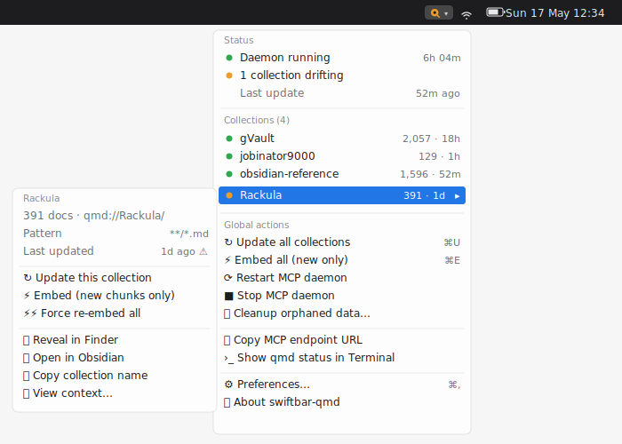

# swiftbar-qmd

> Real-time operational visibility for [qmd](https://github.com/tobi/qmd) in
> your macOS menubar.

A [SwiftBar](https://github.com/swiftbar/SwiftBar) plugin that puts
[qmd](https://github.com/tobi/qmd) state in your macOS menubar: collection
health, MCP daemon status, embedding coverage, and one-click maintenance.



## What it does

swiftbar-qmd surfaces operational visibility into a running qmd installation
through the macOS menubar. It answers two questions on an ongoing basis: *what
is qmd doing right now*, and *what state are my collections in*. It also
provides one-click access to common maintenance actions (`qmd update`,
`qmd embed`, MCP daemon control) so those operations do not require switching
to the terminal.

The plugin is ADHD-first in design: a single at-a-glance visual signal (the
menubar icon's colour) answers "do I need to click?" without opening the menu,
the dropdown is organised by signal type for fast scanning, and notifications
are reserved for failures so the tool does not accumulate notification debt.

It is explicitly **not** a search interface. Searching is qmd's CLI / MCP /
SDK job, and a separate TUI ([lazyqmd](https://github.com/AlexZeitler/lazyqmd))
already covers that surface. swiftbar-qmd is an operational dashboard.

## Why this exists

[qmd](https://github.com/tobi/qmd) is a fast, local-first search engine for
markdown notes and knowledge bases. It ships a CLI, an MCP server, and an SDK,
all excellent. What it doesn't ship is any menubar surface, so the only ways to
check whether your index is healthy, whether collections are fresh, or whether
the daemon is running are `qmd status` in a terminal or hitting `/health` by
hand.

swiftbar-qmd fills that gap. A coloured icon (green, amber, red, or hollow grey)
summarises index health at a glance. The dropdown lists every collection with
freshness and coverage. Update, embed, and daemon controls are one click away,
so routine maintenance stops requiring a terminal.

Search isn't part of the design. That's
[lazyqmd](https://github.com/AlexZeitler/lazyqmd)'s job.

## Install

Three paths, all sharing the same GitHub-hosted `.ts` artifact. Each requires
[Deno 2.x](https://deno.com/) and [SwiftBar 2.x](https://swiftbar.app/) already
on your Mac.

### Manual install

```bash
mkdir -p ~/Library/Application\ Support/SwiftBar/Plugins
curl -L https://raw.githubusercontent.com/ggfevans/swiftbar-qmd/v1.0.0/qmd.30s.ts \
  -o ~/Library/Application\ Support/SwiftBar/Plugins/qmd.30s.ts
chmod +x ~/Library/Application\ Support/SwiftBar/Plugins/qmd.30s.ts
# Restart SwiftBar; the icon appears within 30 seconds.
```

### Curl installer

```bash
curl -fsSL https://raw.githubusercontent.com/ggfevans/swiftbar-qmd/main/install.sh | bash
```

The installer downloads `qmd.30s.ts` and `config.example.yml`, sets the
executable bit, and seeds `~/.config/swiftbar-qmd/config.yml` from the example
if it isn't already present. Pass a tag or branch as the first positional
argument to pin a specific version:

```bash
curl -fsSL https://raw.githubusercontent.com/ggfevans/swiftbar-qmd/main/install.sh | bash -s v1.0.0
```

### SwiftBar "Install from URL"

Open SwiftBar → Preferences → Plugins → **Install from URL** and paste:

```text
https://raw.githubusercontent.com/ggfevans/swiftbar-qmd/main/qmd.30s.ts
```

SwiftBar handles download and placement. You still need Deno on your `$PATH`.

## Configure

Configuration lives at `~/.config/swiftbar-qmd/config.yml`. Clicking the
**Preferences…** entry in the dropdown opens it in your default editor
(`$EDITOR`, falling back to `open -t`). Changes are picked up on the next
30-second poll; no SwiftBar restart needed.

See [`docs/planning/SPEC.md` §7.2](docs/planning/SPEC.md#72-schema) for the full
schema (rollup thresholds, notification toggles, UI options, log retention) and
[`config.example.yml`](config.example.yml) for an annotated example with all
defaults.

## What the icon colours mean

| Icon  | Tier  | Meaning                                                                            |
| ----- | ----- | ---------------------------------------------------------------------------------- |
| Green | Green | All collections fresh and reachable, daemon running, no recent failures.           |
| Amber | Amber | In-flight job, coverage drifting, freshness expiring, or recent op failure.        |
| Red   | Red   | Daemon stopped, collection unreachable, coverage broken, or fresh recent failure.  |
| Grey  | Grey  | No collections configured / first-run state. The plugin is healthy; qmd is empty. |

Full precedence rules and thresholds are in
[`docs/planning/SPEC.md` §9.1](docs/planning/SPEC.md#91-precedence).

## Requirements

- macOS (Apple Silicon or Intel)
- [SwiftBar](https://swiftbar.app/) 2.x
- [Deno](https://deno.com/) 2.x
- [qmd](https://github.com/tobi/qmd) v2.x configured with at least one
  collection

## Development

Local checks:

```bash
deno task test    # full test suite (203+ tests)
deno task fmt     # format
deno task lint    # lint
deno task check   # type-check
```

- Project layout and module contracts are in
  [`docs/planning/SPEC.md` §5](docs/planning/SPEC.md#5-repository-layout-and-module-contracts).
- Architectural decisions are in
  [`docs/planning/DECISIONS.md`](docs/planning/DECISIONS.md).
- The 17-step implementation plan is in
  [`docs/planning/PROMPTS.md`](docs/planning/PROMPTS.md).
- Conventions for AI agents working on this repo are in
  [`AGENTS.md`](AGENTS.md).

## Troubleshooting

**Icon never appears.** Confirm `qmd.30s.ts` is in
`~/Library/Application Support/SwiftBar/Plugins/`, is executable
(`chmod +x`), and that SwiftBar's plugin folder is set to that location.
Restart SwiftBar (Cmd-Q in the SwiftBar menu, then relaunch). The first poll
takes up to 30 seconds.

**Icon stays grey.** The plugin reports no collections (usually because
`qmd` is missing from `$PATH` or `~/.cache/qmd/index.sqlite` doesn't exist yet).
Run `qmd update` against at least one collection to populate the index, then
wait for the next poll.

**Notifications not appearing.** Open System Settings → Notifications and
confirm **SwiftBar** is allowed to deliver notifications. Failure-class
notifications are on by default; success and threshold-breach notifications
are opt-in (see [`config.example.yml`](config.example.yml)).

## Status

The v1.0.0 spec is locked and implementation is complete; see
[`CHANGELOG.md`](CHANGELOG.md) for what shipped.

## AI disclosure

This project is **ai-generated**: the spec, planning docs, and code are drafted
by [Claude](https://claude.com) (Anthropic's AI assistant, currently Claude
Sonnet 4.6 and Opus 4.6) and reviewed by Gareth Evans before they land in the
repo. Gareth is accountable for what ships. Conventions for AI agents working
on this repo are documented in [`AGENTS.md`](AGENTS.md).

The "ai-generated" label follows the disclosure spectrum proposed by
[dweekly/ai-content-disclosure](https://github.com/dweekly/ai-content-disclosure)
and the OCaml community's
[voluntary AI disclosure proposal](https://anil.recoil.org/notes/opam-ai-disclosure):
`none` / `ai-assisted` / `ai-generated` / `autonomous` / `mixed`. AI-assisted
commits carry an `Assisted-by:` trailer.

## For implementers

- [`docs/planning/SPEC.md`](docs/planning/SPEC.md), the canonical v1
  specification.
- [`docs/planning/DECISIONS.md`](docs/planning/DECISIONS.md), rationale for the
  16 architectural choices.
- [`docs/planning/RESEARCH.md`](docs/planning/RESEARCH.md), background research
  that informed the design.
- [`docs/planning/PROMPTS.md`](docs/planning/PROMPTS.md), 17-step implementation
  plan with code-gen prompts.
- [`todo.md`](todo.md), the working checklist.

## License

MIT. See [`LICENSE`](LICENSE).
